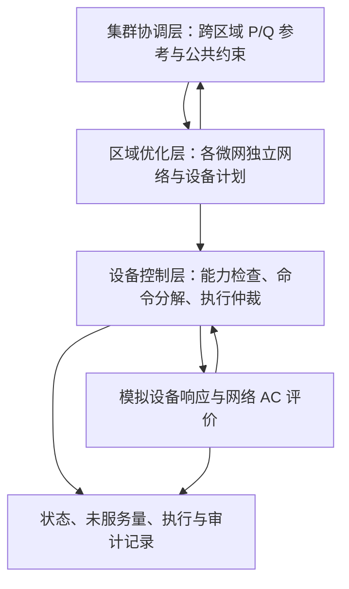

# 区域型油田电网新能源协同控制运行技术研究——五项技术成果交付说明

**阅读导航：** [总体说明](#1-交付依据与总体说明) · [潮流模型](#2-交付项一针对山城区域微电网开展潮流计算模型分析) · [单微网策略](#3-交付项二制定基于油田电网的单微电网最优控制策略) · [分层集群模型](#4-交付项三开发分层分级的分布式微电网集群控制模型) · [集群算法](#5-交付项四研究多微电网集群优化控制算法) · [工程对接](#6-交付项五优化工程应用对接模型) · [清单与复现](#7-交付清单与复现方法) · [验证证据](#8-验证记录证据范围与复核) · [验收条件](#9-正式验收条件与待完成事项)

## 1. 交付依据与总体说明

### 1.1 原文依据与范围

本文件依据《3.1 技术要求及方案（区域型油田电网新能源协同控制运行技术研究）630》中“技术要求”“委托研发方案”及价格构成清单的服务内容编制，对以下五项逐项说明：

1. 针对山城区域微电网开展潮流计算模型分析。
2. 制定基于油田电网的单微电网最优控制策略。
3. 开发分层分级的分布式微电网集群控制模型。
4. 研究多微电网集群优化控制算法。
5. 优化工程应用对接模型。

### 1.2 技术目标与成果对应关系

| 技术要求 | 本次交付中的对应内容 | 最终工程评价所需依据 |
|---|---|---|
| 适应油田电网结构与新能源接入特征 | 网络、设备、运行方式和测点模型；单微网及跨区域协同算法 | 经确认的真实拓扑、设备参数、运行方式及资源映射 |
| 考核点不倒送 | 计划层动态受电下界、独立 AC 校核、分钟级群控与本地安全干预 | 真实考核点位置、方向、容差、动作权限和执行量测 |
| 与上级电网连接点平均考核功率因数在 0.9 以上 | 调度 P/Q 约束、PCC 功率因数计算、计划与分钟执行检查 | 考核周期、计量口径、低负荷处理及真实量测；不能用单点达标替代平均考核 |
| 电压分布符合要求 | 节点电压约束、独立潮流和越限报告 | 各电压等级的获批限值及适用标准条款 |
| 节点电压偏差、网损等不少于两个优化子目标 | 加权多目标网络优化模型 | 各目标权重、成本口径及同条件对比方案 |
| 单微网运行经济性提升 10%以上 | 成本分项计算、基准与优化方案对比机制；当前“储能对照收益”为禁用储能算例对照，原始要求未指定这一基准 | 双方确认正式基准策略、设备配置、真实输入、完整成本口径及验收方法，见 3.6 节 |
| 微电网数量不少于三个 | SC、YA_B、YA_C 三区域合成算例及协调模型 | 至少三个实际微电网的资料、边界与共同时标 |
| 结合 D5000 形成工程对接模型 | 文件化输入、点表与方向转换、控制契约、回执及失效处理边界 | 实际协议、点号、质量码、命令语义、联调环境与现场许可 |

### 1.3 当前成果状态

| 交付项 | 当前可以交付的内容 | 尚不能据此作出的结论 |
|---|---|---|
| 1. 潮流计算模型分析 | 正序径向网络模型、固定状态 AC 潮流、设备扰动对照、山城资料参考型模拟算例 | 已完成真实山城接线和现场量测校准 |
| 2. 单微网最优控制策略 | 多时段 MISOCP、设备 P/Q 分解、光伏群控、分钟执行与网络反馈 | 真实山城经济性已提升 10%以上，或现场设备已闭环受控 |
| 3. 分层分级集群模型 | 集群—区域—设备分层、P/Q 参考与反馈、模拟通信与异常恢复 | 已部署跨区域主站和站端控制系统 |
| 4. 集群优化控制算法 | 凸共识 ADMM、区域独立 AC 一致 MISOCP、集中式参考及分阶段评价 | 原非凸问题的全局最优性或任意网络条件下均收敛、安全 |
| 5. 工程应用对接模型 | 数据格式、契约、适配边界、文件接入、模拟设备服务和运行管理 | D5000 真实通信、现场点表和遥控遥调联调已完成 |

五项成果形成了可运行的研究与软件验证基础。现场资料、工程接入及正式指标评价仍有明确的关闭条件，见第 9 节；不使用主观完成百分比替代这些条件。

### 1.4 数据与结果的统一解释

新业务入口共用统一模拟台账，历史捕获包保留原输入；应按输入身份区分结果：

| 资料或入口 | 数据结构与用途 | 解释边界 |
|---|---|---|
| `oilfield_energy.build_synthetic_case()` | 从统一台账构造SC、YA_B、YA_C，用于通用优化、集群研究及普通Web任务 | SC十母线九支路；延安两区各七母线六支路，模型结构与容量按区域区分 |
| `examples/system_demo/` | 设备演示操作说明；新包通过统一台账生成，旧捕获包独立读取 | 模拟设备服务及其提交任务保留所属数据版本，不能与现场运行记录混用 |
| `src/oilfield_energy/bootstrap/assets/unified_dataset.json` | 统一三区域台账；SC参考山城，YA_B参考化子坪，YA_C参考榆树 | 部分参数有资料依据，其余为模拟设定；非现场完整模型 |
| `examples/shancheng_dataset/` | 固定状态入口说明，实际输入由统一SC台账生成 | 与山城专项研究使用同一网络及设备身份 |
| 八类光伏群控场景 | 预设功率、响应和回执，实际调用群控监督器 | 验证控制分支，不是某一地区的事件实录，也不是设备与网络物理闭环 |

额定容量、可用出力、预测值、优化计划、控制命令、模拟实际响应和现场量测分别保存、分别解释。优化计划不能直接标记为执行实绩；合成输入不能标记为现场数据。

## 2. 交付项一：针对山城区域微电网开展潮流计算模型分析

### 2.1 目标与交付内容

本项用于回答：在明确的网络接线和设备运行状态下，山城微电网各节点电压、支路潮流、电流、负载率、损耗以及 PCC 有功、无功和功率因数如何变化，新能源和调节设备如何影响这些量。

交付包括网络与设备模型、固定时刻输入组织、AC 潮流计算、固定条件扰动对照、运行方式及单支路故障静态筛查能力，以及相应可复现输入和结果格式。实际网络计算入口与优化入口分开，固定潮流不会为消除越限自动修改设备出力。

### 2.2 网络与设备的数学表示

| 对象 | 当前建模方式 | 主要参数与输出 |
|---|---|---|
| 上级电网和 PCC | 明确边界母线、电压和受电方向 | PCC P/Q、受电或倒送状态、功率因数 |
| 母线与线路 | 平衡三相正序等值，径向支路 R/X 与电压基准 | 节点电压、支路两端 P/Q、电流、损耗及负载率 |
| 变压器 | 串联阻抗与固定变比，按两侧电压基准换算 | 固定档位对电压和潮流的影响 |
| 固定并联补偿 | 给定投入状态及参数的并联元件 | 相应无功或并联导纳作用 |
| 风电、光伏 | 固定潮流中为给定实际 P/Q 注入；优化中另施加可用量与能力约束 | 注入功率及容量越限情况 |
| 储能 | 固定时刻为给定充放电 P/Q；多时段时另计能量动态 | 充放电对 PCC、电压和线路潮流的影响 |
| SVG | 给定无功注入；调度阶段在能力范围内调节 | 无功补偿、电压和 PCC 功率因数变化 |
| 油田负荷 | 按母线接入的恒功率 P/Q 负荷 | 有功和无功需求；保留总负荷计量边界 |

固定状态下，节点净消耗由负荷消耗减去设备注入形成。储能充电计入消耗，放电计入注入。内部 PCC 有功正值统一表示从上级电网受电；原始测点方向在接入边界显式转换。

独立 AC 潮流采用前推回代法：由节点复功率和电压计算注入电流，自末端汇总支路电流，再由边界向下游更新复电压，迭代至满足数值要求。输出还检查功率平衡残差及工程限值，分别记录输入是否有效、潮流是否收敛、约束是否满足。收敛不等于安全。

核心实现见 [网络模型](../src/oilfield_energy/network_model.py)、[AC 潮流](../src/oilfield_energy/ac_power_flow.py)、[固定状态对照](../src/oilfield_energy/power_flow_comparison.py) 和 [现场时刻输入](../src/oilfield_energy/field_data/snapshot_power_flow.py)。

### 2.3 山城资料参考型模拟配置

当前业务基线为`2026-09-21-v1`，SC沿用十母线九支路：参考资料的35 kV并网连接、风电汇集和独立储能/SVG支路，另保留模拟光伏及35/10 kV扩展。SVG额定2 MVA、调节边界±1.8 Mvar；风电2×5 MW、储能2.5 MW/5 MWh。

完整接线、原始PDF页码与摘要、参数取舍及未确认项见[统一模拟数据说明](统一模拟数据说明.md)。统一台账是唯一默认输入；线路R/X、热限、电压判据、SOC数值、负荷/光伏配置及曲线等继续模拟。历史七母线归档保留原有身份和参数，不作为当前十母线模型的验证证据。

### 2.4 分析步骤与输出

1. 核对网络边界、运行方式、设备与负荷覆盖、P/Q 方向、时间和质量信息。
2. 捕获一份不可变输入快照，保存版本与摘要。
3. 在指定运行时刻执行固定状态 AC 潮流，保留无效、越限和不收敛状态。
4. 固定其他设备及负荷，仅改变指定设备 P 或 Q，比较前后 PCC、电压、损耗及支路负载率。
5. 对明确的运行方式或单支路退出进行静态筛查；孤岛或不支持的网络给出原因和失联范围。
6. 导出结果、输入副本和运行依据，供复算与模型校准。

固定资料集输出包括 `power_flow.json`、`buses.csv`、`branches.csv`、`system.csv`、输入归档及 `completion.json`。专项研究还输出 `fixed/` 和 `comparisons/`，逐项保存代表时刻及设备扰动的结果。

### 2.5 验证及适用范围

本次重新运行三母线文件集示例，结果为 `secure`，PCC 受电约 3.716104326 MW、有功损耗约 0.016104326 MW、功率因数约 0.968070809。这些数值只证明该合成输入的计算链可复现，不能用作山城实测数据。

已有七母线全日归档包含三个代表时刻、六个独立资源扰动及后续全日研究；本次核对其完成清单的 160 个文件，摘要均匹配。证据范围和日期见第 8 节。

当前求解范围为正序径向网络及支持的固定设备模型。环网、三相不平衡、非零相移等不支持条件必须明确报告；静态 N−1 分析不替代暂态稳定、保护配合和切换过程分析。真实山城潮流分析还需实际接线、逐支路参数、同期 P/Q、边界电压及独立量测对比。

## 3. 交付项二：制定基于油田电网的单微电网最优控制策略

### 3.1 策略结构

单微网策略包括三个相互衔接的部分：多时段运行计划优化、逐设备指令分解、执行期间的安全监督。优化负责在约束下分配资源；控制器负责检查目标可达性、权限和响应；AC 校核负责独立评价网络状态。

计划层采用基于支路潮流模型的混合整数二阶锥优化（MISOCP），由 PySCIPOpt 调用 SCIP 求解。Web 单微网请求使用 `misocp`；旧 LinDistFlow MILP 保留为显式历史对照，不作为当前默认模型。

### 3.2 决策变量、目标与约束

| 类别 | 内容 |
|---|---|
| 决策变量 | 各时段 PCC P/Q、风光利用出力及允许的无功、储能充放电与能量、SVG 无功、节点平方电压、支路 P/Q 与电流平方变量 |
| 经济及运行目标 | 购电、弃风弃光、储能吞吐退化、有功网损、电压偏差、PCC 功率变化；按明确权重组合 |
| 网络约束 | 节点有功无功平衡、完整电压降、支路两端容量、电压上下限、PCC 受电范围及功率因数 |
| 设备约束 | 风光可用量、P/Q 能力包络和授权，SVG 无功能力，储能功率、能量、效率、末端能量及充放电互斥 |
| 安全衔接 | 计划受电下界同时考虑区域最小受电要求、全局防倒送裕度和动态群控安全阈值 |

可概括为：

\[
\min J=C_{购电}+C_{弃电}+C_{储能退化}+C_{网损}
       +\lambda_V\sum_{i,t}|v_{i,t}-1|\Delta t
       +\lambda_R\sum_t|P_{PCC,t}-P_{PCC,t-1}|,
\]

其中 `v=|V|²`。电压项采用平方电压偏离 1 的绝对值辅助变量，不应写成电压幅值偏差平方的另一套目标。具体计价及权重以输入与实现为准；加权目标法不意味着已经生成完整 Pareto 前沿。

在统一标幺体系、无变比支路的简化表达中，支路关系包括 `P²+Q²≤v·ℓ`，有功、无功损耗分别为 `rℓ`、`xℓ`；程序实际按容量基准处理 MW/Mvar 与标幺量，并计入固定变比。线路和变流器容量采用保守多边形约束。不能脱离变量单位直接照抄该简式进行工程计算。

储能能量满足：

\[
E_{t+1}=E_t+\eta_{ch}P_{ch,t}\Delta t
                    -P_{dis,t}\Delta t/\eta_{dis}.
\]

代码依据见 [MISOCP 模型](../src/oilfield_energy/misocp_model.py)、[规划安全下界](../src/oilfield_energy/planning_security.py) 和 [成本计算](../src/oilfield_energy/modules/dispatch/domain.py)。

### 3.3 优化结果接受规则

默认先放松储能模式的二进制约束以提高效率，再检查是否存在实质性同时充放电；互斥证书不成立时恢复二进制模型重求解。可行证书不等于无条件证明精确最优，必须同时查看求解状态和 `mip_gap`。SCIP 在时限内返回可行解时，也可能带有尚未闭合的最优性间隙。

优化后使用独立 AC 潮流，比较 PCC P/Q、节点电压和逐线路损耗，同时检查锥松弛误差。默认数值阈值包括最大相对锥间隙 `1e-6`、PCC 有功差 `1e-4 MW`、无功差 `1e-4 Mvar`、电压差 `1e-5 pu`、支路有功及无功损耗差分别 `1e-5 MW/Mvar`。未通过时增加损耗紧化项或电压裕度，最多进行三轮一致性求解。

这些是软件一致性参数，不是现场保护定值。结果只有在对应检查通过后才能作为当前模型范围内的 AC 一致方案接受。实现见 [AC 一致性流程](../src/oilfield_energy/ac_consistency.py)。

### 3.4 设备控制及光伏群控

山城设备控制器接收本地或调度目标，对有功、无功目标进行能力与状态检查。风储分配考虑当前可用功率、储能授权能力和联合 P/Q 包络；无功分解结合风机与 SVG 能力。目标不可达时保留未服务量或拒绝原因，不能仅修改界面数值宣称执行成功。

光伏群控监督器根据 PCC 功率、净负荷变化和倒送风险形成动态阈值，执行紧急限发、连续三次或五次中三次越限防抖、二次限发、限发保持、渐进恢复和异常闭锁。默认恢复步长为本轮恢复起始限发量的 10%，每步完整监测三分钟，并核对响应；这些仍是待现场确认的参考参数。

群控与硬保护维护各自的绝对功率上限，经统一仲裁后作用于设备。PV 调节不足时，安全干预可经山城控制器继续分解到储能和风机。恢复需要有效量测、明确响应和相应复归条件，不能因通信刚恢复就自动解除所有限制。

当前“光伏群控策略验证”页面运行八类固定场景，验证监督器决策；完整分钟物理反馈在专项研究和设备模拟流程中另行执行。实现见 [山城控制器](../src/oilfield_energy/shancheng_control.py)、[群控监督器](../src/oilfield_energy/group_control.py)、[执行仲裁](../src/oilfield_energy/actuation_arbiter.py) 和 [分钟网络反馈](../src/oilfield_energy/minute_network.py)。

### 3.5 日前、日内与分钟执行

当前山城专项研究先生成 96 点日前计划；日内每 15 分钟求解一个最多 16 时段的窗口，只采用第一个时段，并把该时段计划末能量传给下一窗口。拼接 96 个采用时段后，再以独立分钟外部输入连续执行 1,440 步，并逐分钟计算网络反馈。

这一流程已经包含连续离线滚动计算，但分钟实际 SOC 尚未实时反馈到在线日内重调度器。因此不能将其表述为已部署、长期运行的在线 MPC 服务。采用计划使用 `adopted-schedule-v1`，保留每个时段来源；不能把重叠窗口费用相加，也不能借用第一窗口的求解证书证明拼接计划全局最优。

当前山城专项优化关闭光伏和储能无功控制，即使配方中记录了视在容量，也不自动等于获得 Q 调节授权。设备实际授权应由接入资料明确。实现见 [专项输入与计划装配](../src/oilfield_energy/bootstrap/adapters/simulation_case.py) 和 [专项运行器](../src/oilfield_energy/bootstrap/adapters/simulation_runner.py)。

当前新生成的模拟算例以显式策略区分风机无功边界：SC采用《山城微电网控制策略逻辑.pdf》第3、5页的30%比例，YA_B、YA_C采用《西交大-资料提供.pdf》第9页的精确33.3%比例。优化与设备执行同时叠加独立的绝对无功容量、视在容量及运行状态限制；比例不是必达出力。原模拟台账中的容量假设保留并标注来源，不能作为现场铭牌证明。光伏Q=0有“光伏纯有功输出”的直接资料依据。历史版本的32.8%仅作为旧模拟参数保留，不表述为甲方规定。详见 [统一模拟数据说明](统一模拟数据说明.md)。

### 3.6 经济性评价及 10%目标

#### 3.6.1 原始要求与对照基准

技术要求第（4）项明确提出：

> 设计单微电网运行的优化数学模型，综合考虑风机、SVG、储能等多类电源因素，保证微电网所属的区域电网新能源不倒送、运行经济性提升10%以上。

委托研发方案第（1）项同时明确，研究对象为已运行的山城区域微电网，包含 2.5 MW / 5 MWh 储能；第（2）项要求“在现有微电网运行基础上”形成新能源最优协同控制策略。

上述原文要求评价协同控制后的运行经济性，但**没有明确要求以“不启用储能”为对照组，也没有明确规定基准运行策略、成本统计口径和收益计算公式**。因此，当前程序采用的禁用储能对照属于软件算例的比较设置，不能直接认定为甲方已经确认的正式验收基准。依据见[技术要求及方案原文件](../docs3/3.1%20技术要求及方案（区域型油田电网新能源协同控制运行技术研究）630.docx)。

#### 3.6.2 当前储能对照收益的含义

单微网仿真页面的“储能对照收益”，表示当前模拟输入及成本参数下，相对于禁用储能方案的运行成本下降比例。程序在同一份算例上分别求解以下两个方案：

| 比较项 | 基准方案 | 优化方案 |
|---|---|---|
| 负荷、风光可用出力、电价及网络参数 | 使用本次模拟输入 | 使用同一份模拟输入 |
| 储能参与方式 | 固定禁用储能 | 按“启用储能优化”设置决定是否参与 |
| 其他资源 | 仍对风光利用、无功调节等进行优化 | 在储能参与设置下共同优化 |
| 结果用途 | 提供禁用储能条件下的优化成本 | 与基准比较储能参与条件变化后的成本 |

因此，该比较可以用于分析储能参与调度的成本影响，不能直接解释为“原有控制策略与新协同控制策略”的效果对比。基准方案并非未经优化的运行方案，也不是甲方现行运行策略的真实回放。若页面关闭储能，两套方案均禁用储能，此时比较已不能用于评价启用储能的贡献。

#### 3.6.3 计算公式与成本口径

当前程序对正的基准成本采用以下公式：

\[
\eta=(C_{基准}-C_{优化})/C_{基准}\times100\%.
\]

其中，\(C_{基准}\) 和 \(C_{优化}\) 分别为上述两个方案在同一仿真周期内的模型运行成本，由购电费用、弃风弃光计价、储能充放电吞吐退化费用和网损计价四部分构成。正值表示优化方案成本较低，负值表示成本较高。

该百分比不是储能投资回报率，不包含储能建设投资及全寿命周期现金流评价，也不代表现场已经实现的收益。人工电压偏差权重及协调罚项不应混入正式经济性收益。页面已注明“相对禁储能对照 · 非现场提升”。

实现依据见[单微网方案设置](../src/oilfield_energy/service.py)、[成本差计算](../src/oilfield_energy/analysis.py)、[运行成本分项](../src/oilfield_energy/modules/dispatch/domain.py)及[页面指标](../web/frontend/components/simulation-dashboard.tsx)。

#### 3.6.4 正式经济性评价的建议方法

针对现有微网已经配置储能的条件，建议在设备配置一致、储能均可按各自策略参与的前提下，对比“甲方现行运行策略”与“拟交付的协同优化策略”，以评价控制策略改进的作用。禁用储能对照可保留为补充研究，用于分析储能参与的影响。**这一评价安排属于建议，尚需双方确认，不是原始文件已经指定的验收方法。**

正式评价前应共同确认：

1. 基准策略的具体规则、参数及依据，明确如何复现现行运行方式，不以禁用储能代替原策略。
2. 比较采用的真实负荷、风光可用出力、设备配置与可用状态、网络参数及评价周期，保持双方输入和统计范围可比。
3. 储能初始 SOC、末端 SOC 或剩余能量价值处理，以及相同的不倒送、功率因数、电压等安全要求，避免通过消耗不同的存量能量形成表观收益。
4. 电价、计费周期、需量或容量费用是否纳入、弃电价值和储能退化计价，并核对网损是否已包含在购电费用中，避免重复计价。
5. 成本下降比例的计算方法、异常时段处理、结果证据和确认流程。基准成本不大于零或比较条件不一致时，不应强行给出有意义的收益百分比。

**即使当前页面的“储能对照收益”超过 10%，也不能据此认定已满足原始要求中的“运行经济性提升 10%以上”。** 现有 CLI 输出明确设置 `formal_ten_percent_requirement_certified=false`，见[评价范围声明](../src/oilfield_energy/cli.py)。该正式指标仍需在双方确认基准和统计口径后，依据真实数据、同等安全条件及可复核结果进行评价，当前不能写为已通过现场验收。

### 3.7 新能源事件注入的用途与验证范围

#### 3.7.1 与原始技术要求的关系

技术要求提出不倒送、功率因数和电压约束；委托研发方案要求开展潮流分析、形成新能源协同控制策略，并在第（3）项提出“开展对应的优化仿真分析”。**原始文件没有明确要求开发“新能源事件注入”功能，也没有规定“光伏大发”“风电大发”按钮、扰动倍率或持续时间。** 该功能是项目为开展场景对照和辅助验证而提供的研究工具，不是原文单独列明的必交功能。依据见[技术要求及方案原文件](../docs3/3.1%20技术要求及方案（区域型油田电网新能源协同控制运行技术研究）630.docx)。

该功能的交付定位为“新能源出力变化场景的仿真对照工具”：在其他输入和配置保持一致的条件下，改变指定区域、指定时段的新能源可用出力，比较优化方案及约束校核结果。它用于研究新能源出力增加时，PCC 受电、储能充放电、风光限发、无功调节、电压、线路负载、网损及运行成本如何变化。具体变化取决于输入条件和求解结果，不能预先承诺每次注入都会触发充电、限发或其他特定动作。

#### 3.7.2 当前事件设置与处理流程

| 设置项 | 当前实现 |
|---|---|
| 事件类型 | 光伏大发、风电大发，分别调整对应资源的可用有功出力 |
| 作用区域 | 单微网页面固定为当前已完成结果的区域；综合态势页面可选择作用区域 |
| 起始时刻 | 当前已完成结果的回放时刻 |
| 出力变化 | 将事件时段内对应资源的可用出力乘以 1.35，并限制在各自装机容量以内 |
| 持续时间 | 最长 180 分钟；接近当天末尾时在 24:00 截止 |
| 处理方式 | 保留原结果作为对照，在算例副本上应用事件，提交新的分支任务并重新求解 |

1.35 倍和 180 分钟属于当前页面的预设场景参数，不是甲方规定的考核值。后端按仿真时间网格修改落在事件区间内的输入点；增加的是“可用出力上限”，实际采用多少新能源出力仍由优化模型在负荷、储能、PCC 和网络约束下决定。原可用出力为零时，乘法放大仍为零；达到装机容量上限后也不会继续增加，因此需要核对输入曲线是否实际发生变化。

事件分支沿用已完成结果的仿真配置及已有事件，再追加本次事件，原算例对象不被直接修改。实现依据见[页面事件设置与分支提交](../web/frontend/components/simulation-dashboard.tsx)、[事件输入处理](../src/oilfield_energy/scenario_events.py)和[单微网求解流程](../src/oilfield_energy/service.py)。

#### 3.7.3 全周期重新优化与实时响应的区别

当前按钮先修改输入，再重新优化整个仿真周期。程序没有固定事件发生前的调度计划，也没有从注入时刻的实际设备状态和储能 SOC 接续执行。由于整个事件时段已作为输入提供给求解器，优化结果可能提前调整储能充放电，事件发生前的计划也可能随之改变。

因此，该功能支持的是“已知新能源出力变化条件下的方案对比”，不能将页面上的“当前时刻注入”理解为对运行中的现场设备实时施加扰动。它与第 2 节“固定其他设备状态、改变指定设备 P/Q 后直接计算潮流”的分析也不同：本功能允许重新优化调度，固定状态潮流对照则不重新优化设备出力。

这里还存在两种不同的比较关系：事件对照比较“追加事件前的方案”与“追加事件后的方案”；3.6 节的储能对照则是在同一份输入下比较禁用储能与按配置使用储能的方案。事件分支会在修改后的输入上重新计算自身的储能对照，不能把“储能对照收益”当作事件前后成本变化的百分比。

#### 3.7.4 证据记录与工程评价边界

进行事件对照时，应同时记录原任务与分支任务、输入版本、已有事件及新增事件、作用区域、起止时刻、倍率、实际生效的输入点，以及两套结果的求解状态、成本分项、调度计划和独立 AC 校核。已有[事件执行测试](../tests/integration/studies/test_event_execution.py)包含对单微网风电事件在指定时段内按倍率和容量上限生效、事件外输入保持原值的检查；这类检查证明的是输入处理及计算链的行为。

**事件分支计算完成或校核通过，只能支持相应输入条件下的优化与网络约束评价，不能单独证明现场实时抗扰能力、控制响应时间、暂态稳定性或设备实际执行效果。** 若需评价上述工程能力，应另行明确初始运行状态、扰动发生方式、控制周期、设备动态、量测和回执等条件，并形成对应的验证方案。是否将这些验证纳入正式验收及采用何种指标，需双方确认，不能由页面功能直接推定。

## 4. 交付项三：开发分层分级的分布式微电网集群控制模型

### 4.1 分层职责与信息流



| 层级 | 主要输入 | 主要输出 | 职责边界 |
|---|---|---|---|
| 集群协调层 | 各区域聚合负荷、资源能力、P/Q 计划、公共受电约束 | 逐区域 P/Q 协调参考、迭代状态及残差 | 不直接替代区域设备可行性检查 |
| 区域优化层 | 集群参考、区域拓扑、设备参数、预测及安全下界 | 独立 AC 一致的设备计划、PCC 实现值与参考偏差 | 对本区域网络和设备约束负责 |
| 设备控制层 | 采用计划、模拟实际状态、授权、质量、回执及网络评价 | 设备目标、限发恢复动作、能力或执行异常 | 区分命令、接受、执行和实际响应 |
| 运行与展示层 | 作业状态和各阶段结果 | 进度、回放、报告、导出与审计 | 不自行重算安全结论或补造量测 |

当前“分布式”表示各区域模型、状态和消息在程序中逻辑分离，协同过程由同进程离散事件仿真编排。尚未据此形成实际跨区域网络上的多主机控制部署。

### 4.2 三区域评估模型

默认 SC、YA_B、YA_C 构成三个微电网。当前YA_B参考化子坪、YA_C参考榆树，风电容量分别为10、5、5 MW；光伏分别为4.2、3.2、3.8 MW，储能分别为2.5 MW/5 MWh、2 MW/4 MWh、1.8 MW/3.6 MWh。SC采用十母线九支路，两处延安模型各七母线六支路，分别保留化子坪线路T接与榆树站内35 kV接入关系、35/10 kV主变并列等值。延安光伏、储能、SVG及负荷时序仍是模拟扩展，不能当作当地设备台账；资料依据和换算见[统一模拟数据说明](统一模拟数据说明.md)。

模型设置 26 MW 合成公共受电通道上限以产生集群耦合。该值用于算法研究，不证明实际区域共用这一物理通道。现场建模必须确认区域之间是信息协调、电气联络还是共同考核关系，不能为构造集群而虚设联络线或共同容量约束。

本套合成模型满足不少于三个微网的数量性演示条件；不少于三个实际微网的工程评价需逐区资料齐备。数据定义见 [通用合成算例](../src/oilfield_energy/data.py)。

### 4.3 时间尺度与流程区别

| 流程 | 实际执行范围 |
|---|---|
| `run_model.py hierarchical` | 集中式参考、ADMM、各区域独立落实、一次代表性日内预测更新和分钟执行，附可选缩小通信故障回归 |
| `oilfield-sim run` 山城专项 | 单区域十母线完整日前、96 次日内滚动和 1,440 分钟执行 |
| Web“集群协调”“通信故障” | 一次启动自动完成集中式参考、ADMM、各区域独立落实、日内更新和分钟执行；逐阶段检查设备、网络、P/Q 跟踪与集群受电约束 |
| Web“光伏群控策略验证” | 八类独立监督器状态机场景 |
| Web“模拟设备演示” | 模拟设备持续状态、显式目标设置、回执和网络反馈；另行提交的优化作业不自动写回设备 |

Web 新任务同时保存 `cluster_execution` 模拟执行证据，只有全部相关判据通过才显示整体通过；历史 `reference_only` 结果仍不能代替执行证据。默认逐点 P/Q 跟踪容差分别为 0.05 MW、0.05 Mvar，是软件仿真假设，不是甲方原文或现场验收定值。原生入口采用同版本模拟数据集的日内和分钟输入；捕获算例缺少这些独立输入时，明确标为沿用原预测的持续性场景。以上均不构成现场设备执行认证。普通合成入口 `steps` 调整的是一天的离散点数，`dt=24/steps`；4 点通用快算并不等于专项测试中的一小时 4 点窗口。

实现依据为 [分层编排](../src/oilfield_energy/hierarchical.py)、[时间与协调配置](../src/oilfield_energy/hierarchy_types.py) 及 [Web 场景服务](../src/oilfield_energy/service.py)。

### 4.4 通信、自治与恢复

模拟通信支持消息延迟、丢包、指定区域失联、过期判断、自治降级和恢复重入。消息接纳检查轮次、发送时刻和有效性；重复或乱序消息不能刷新有效期，失联不能被伪装成正常协调完成。

通信故障按 ADMM 迭代轮次描述，设备控制按模拟分钟描述，两者不直接等同。请求的故障窗口还应核对是否实际执行，提前停止导致未覆盖的窗口不能作为故障测试通过。

交付输出包括 `admm_history.csv`、`regional_targets.csv`、`device_tracking.csv`、群控轨迹与事件以及网络评价记录。真实网络延迟分布、协议重试、带宽、鉴权和长期稳定性需在工程联调中另行验证。

## 5. 交付项四：研究多微电网集群优化控制算法

### 5.1 算法组成与数学关系

采用“凸共识 ADMM 协调—区域独立 MISOCP 落实—集中式 MISOCP 参考对比”的算法结构。

令 `x_i` 为第 i 个区域的聚合 P/Q 轨迹，`z_i` 为集群协调参考，`u_i` 为缩放对偶变量，协调问题可概括为：

\[
\min \sum_i f_i(x_i)+g(z),\qquad x_i=z_i.
\]

其标准更新形式为：

\[
x_i^{k+1}=\arg\min_{x_i\in X_i}
\left[f_i(x_i)+\frac{\rho}{2}\|x_i-z_i^k+u_i^k\|^2\right],
\]

\[
z^{k+1}=\arg\min_{z\in Z}
\left[g(z)+\frac{\rho}{2}\sum_i\|x_i^{k+1}-z_i+u_i^k\|^2\right],
\qquad u_i^{k+1}=u_i^k+x_i^{k+1}-z_i^{k+1}.
\]

`X_i` 表示区域聚合凸约束，`Z` 表示集群公共约束；实际消息延迟、降级和更新接纳由编排层管理。区域凸子问题有意不包含储能二进制决策和完整支路非凸约束，以维持凸协调结构；网络与整数可行性由后续区域 MISOCP 检查。

区域凸问题使用 CVXPY 建模，默认优先 CLARABEL，并按当前实现尝试可用的其他凸求解后端。各后端解决的是该凸协调模型，不是自动将失败的 AC/MISOCP 问题更换为另一物理模型。源码见 [ADMM](../src/oilfield_energy/admm.py) 和 [区域凸模型与集群投影](../src/oilfield_energy/regional_control.py)。

### 5.2 求解流程

1. 构造同一输入条件下的集中式 AC 一致 MISOCP 参考，并获取损耗等对照信息。
2. 各区域求解自治凸计划，初始化区域轨迹、集群参考和对偶变量。
3. 按通信策略交换消息，求解区域子问题并执行集群投影。
4. 在完整且时序一致的协调更新上计算原始残差、对偶残差和相应阈值。
5. 达到连续更新收敛要求后，将参考交给各区域独立 MISOCP 落实，并进行独立 AC 复核。
6. 评价参考与实现偏差、各阶段集群总受电、设备执行及网络结果；未计算阶段保持明确状态。

其中第 5～6 步是完整分层研究的职责。Web 普通集群入口当前止于集中式和 ADMM 参考评价，不应被描述成已经执行全部步骤。

### 5.3 收敛与证据

默认 ADMM 惩罚参数为 120，最大迭代 200，绝对与相对容差均为 `2e-3`，要求连续三次完整更新满足停止条件。运行入口可以设置不同轮次上限，最终以本次请求和结果为准。

原始残差反映区域计划与集群参考的不一致；对偶残差反映参考的变化。收敛证书绑定同一协调更新的区域计划、参考、前次参考和对偶变量，不能把不同轮次的数据拼成一次“通过”。参考费用也必须对应同一快照。

区域参考落实采用 P/Q 跟踪目标与本地网络、设备硬约束，实际实现可能与参考存在偏差。应报告偏差及其原因，并再次汇总同一时标的集群受电；每个区域各自安全并不自动证明公共通道安全。源码中的集群评价分别区分参考、日前、日内和分钟阶段。

### 5.4 对比指标与算法边界

| 评价维度 | 应检查的证据 |
|---|---|
| 协调过程 | 原始与对偶残差、阈值、迭代数、完整更新连续次数、停止原因 |
| 经济性 | 同输入和同口径成本分项；集中式参考、凸协调快照及实际落实分别标识 |
| 区域落实 | P/Q 参考偏差、设备能力、储能互斥证书、独立 AC 一致性 |
| 集群公共约束 | 同一时标下所有区域 PCC 总受电及超限时刻、幅度和阶段 |
| 通信异常 | 实际延迟、丢包、失联、过期拒绝、自治与恢复记录 |
| 设备执行 | 指令与响应差异、SOC、网络有效性、动作后倒送、闭锁与复归 |

本算法不是对原始 MISOCP 的严格等价分解，不能将凸 ADMM 收敛推导为整个混合整数 AC 问题全局最优。当前流程使用集中式参考损耗进行校准，也不能声称算法完全不依赖集中式信息。通信异常下的有效性由实际覆盖和数值证据评价，不作任意丢包或永久失联下必然收敛的承诺。

## 6. 交付项五：优化工程应用对接模型

### 6.1 对接目标与当前实现层次

工程对接将现场原始数据转换为模型可信输入，再将模型目标转换为可审计的命令与反馈。当前交付既包含可运行的文件接入，也包含待真实协议接入的数据契约和控制边界。

| 能力 | 当前状态 | 对应成果 |
|---|---|---|
| 清单和分文件资料捕获 | 已实现 | 严格 JSON、角色/版本、摘要、相对路径校验、不可变捕获 |
| CSV/XLSX 测点到固定时刻潮流 | 已实现 | 点号与设备映射、单位方向转换、质量与时效、运行方式选择 |
| 真实资料到完整优化 `ProjectCase` | 未完成完整链路 | 前置就绪性检查存在；`FieldCaseBuilder.build()` 通过检查后仍明确抛出待实现异常 |
| D5000 PCC 量测适配 | 数据契约与归一化已实现 | 点号、W/kW/MW、倍率、方向、时标、质量与新鲜度 |
| D5000 网络通信与真实点表 | 待工程接入 | 当前适配模块明确不实现网络通信、不内置项目点号 |
| 控制目标与回执边界 | 已有核心及模拟验证 | 命令身份、接受状态、执行是否已知、返校值及复归条件 |
| 实际设备驱动与现场闭环 | 待现场联调 | 需主站、站端、设备协议和获批动作范围 |

关键证据见 [现场算例构造边界](../src/oilfield_energy/field_data/case_builder.py) 和 [D5000 契约](../src/oilfield_energy/field_data/d5000_contracts.py)。文件输入可用于固定潮流，不表示真实全日优化映射已完成。

### 6.2 资料包与输入检查

资料包由 `manifest.json` 引用网络、设备、测点映射、运行方式、设置和量测文件，明确文件角色、版本、摘要及相对路径。模型加载前检查完整性和一致性，捕获后使用固定字节，避免运行期间输入变化造成结果不可追溯。

| 输入类别 | 必需说明 |
|---|---|
| 网络与设备 | 母线、支路、PCC、设备 ID、接入关系、容量、参数单位与基准 |
| 运行方式 | 开关、分接、补偿投退及有效时段；不通过名称猜测状态 |
| 测点映射 | 原点号、目标设备或负荷、P/Q/状态/电压、单位、倍率和正方向 |
| 时间与质量 | 观测时间、时区、采样性质、质量码、最大允许年龄及点间时差 |
| 负荷与发电边界 | 总负荷与净馈线功率分别解释，避免再减新能源造成重复计量 |
| 控制与能力 | 设备可用量、P/Q 包络、SOC、爬坡、最小出力、授权和闭锁 |

固定时刻入口要求支持的瞬时量测语义；按目标时刻和有效期选择样本，不自动用未来值、插值或零值补齐缺失数据。`seal` 是显式封存操作，计算摘要不等于批准资料真实性，摘要不匹配时不能自动重新封存后继续运行。

公开格式见 [现场资料模式](../contracts/field_dataset/)、[模拟研究模式](../contracts/simulation/) 和 [控制记录模式](../contracts/control/)。这些格式由代码中的类型定义导出；变更应先修改权威定义，再生成并检查一致性。

### 6.3 D5000 与设备控制的语义边界

内部 PCC 统一使用“受电为正”，外部采用其他方向时通过明确映射转换。点号、单位、倍率、质量或时间未知时输出无效及原因，不能返回数值零伪装成无负荷。

命令处理须区分目标值、请求身份、传输受理、设备执行确认、返校和实际量测。现有 D5000 回执契约分别记录 `transport_accepted`、`execution_known` 和 `echoed_raw_value`；“主站已接收”不能直接等同于“设备已到位”。

控制域已有陈旧或乱序命令拒绝、能力不足处理、未知反馈阻断和恢复锁存等机制。真实工程对接还需明确绝对值或增量目标、P/Q 单位方向、特殊码、会话与重启、时限、撤销、重试和人工接管；具体点表与动作授权由双方确认后实施。

Web 模拟设备服务具有自己的模拟命令生命周期和故障注入，验证软件流程；其 HTTP/WebSocket 接口不是 D5000 已有协议的替代证明。当前 HTTP 契约见 [OpenAPI](../contracts/openapi/simulation.openapi.json)。

### 6.4 运行管理和交付证据保存

Web 仿真通过作业管理器提交、查询、取消和读取结果，保留请求、状态和相应输入及计算记录。运行状态与工程结论分开：作业结束、求解有解、网络安全和设备执行确认属于不同判断。

当前 Web 作业结果默认保留 24 小时，受管理任务目录总容量上限为 5,000,000,000 字节，包含结果、日志和执行记录；超额时优先清理较早结束的任务，运行中和排队任务受保护。规则也覆盖已有历史任务。容量持续不足时，新任务可能被拒绝，不能把该上限理解为对整块磁盘的绝对占用保证。

正式交付证据应在自动清理前导出到独立、受控归档位置，保留输入、结果、摘要和对应软件环境。此清理机制管理 Web 作业根，不代表所有手工 CLI 输出、`artifacts/` 或整个项目都会自动清理。实现依据见 [运行设施说明](../src/oilfield_energy/runtime/README.md)。

### 6.5 工程落地阶段

| 阶段 | 工作内容 | 阶段完成判据 |
|---|---|---|
| A：真实资料离线建模 | 确认山城拓扑、台账、点表、同期量测，先完成固定时刻潮流，再补齐全日优化映射 | 数据有效，计算与独立量测误差可解释，缺项关闭 |
| B：不少于三区域的优化评价 | 补齐各区域预测、能力、初始状态、共同约束和经济基准 | 同条件对比、区域及集群约束分别有证据 |
| C：只读主站联调 | 接收真实量测和状态，核对方向、质量、时效及历史回放 | 断连、坏质量、过期和恢复行为符合确认规则 |
| D：受控命令联调 | 在获批范围内验证命令、回执、设备响应、拒绝、超时和人工接管 | 端到端执行记录完整，安全闭锁和复归经过见证 |
| E：现场运行评价 | 按确认周期统计不倒送、平均功率因数、电压和经济性 | 形成双方认可的指标报告和验收记录 |

这些阶段是实施建议与尚待关闭的工程条件，不表示本次已完成现场投运。所需资料详见 [需要补充的数据和资料](需要补充的数据和资料.md)。

## 7. 交付清单与复现方法

### 7.1 成果位置

| 交付内容 | 当前项目位置 | 使用说明 |
|---|---|---|
| 本技术成果说明 | 本文件 | 按五项任务审阅实现、证据和边界 |
| Web 使用说明 | [使用说明](Web仿真系统使用说明.md) | 页面用途、操作及结果解释 |
| 甲方资料清单 | [资料清单](需要补充的数据和资料.md) | 分阶段准备真实建模和接口材料 |
| 山城专项配方 | [算例目录](../examples/shancheng_simulation/) | 当前山城模拟输入生成规则与操作说明 |
| 固定状态资料样例 | [文件集目录](../examples/shancheng_dataset/) | 直接加载固定时刻 AC 潮流 |
| 全系统演示资料 | [演示目录](../examples/system_demo/) | 三区域设备模拟和作业输入 |
| 工作簿审计样例 | [审计样例](../examples/demo_audit/) | 合成 Excel 导入及异常识别 |
| 潮流与优化实现 | [源码包](../src/oilfield_energy/) | 网络、MISOCP、AC、ADMM、设备控制及服务 |
| 新模块公开边界 | [业务模块](../src/oilfield_energy/modules/) | 资料、调度、控制、研究等类型与用例 |
| 工作流与适配 | [工作流](../src/oilfield_energy/workflows/)、[装配层](../src/oilfield_energy/bootstrap/) | 输入捕获、计算接线、结果发布 |
| 对外格式 | [contracts](../contracts/) | OpenAPI、JSON Schema 及版本化结构 |
| 环境声明与锁 | [pyproject.toml](../pyproject.toml)、[uv.lock](../uv.lock) | Python 依赖与入口；前端另有 package.json 和 package-lock.json |
| 自动化测试 | [tests](../tests/) | 数值、控制、数据、工作流及架构检查 |

代码组织采用按业务能力划分的模块、公开 API/契约、工作流编排和装配适配边界；部分既有求解与控制代码仍位于原模块，通过适配层衔接。交付说明不宣称整个旧代码库已完成目标架构迁移。

### 7.2 环境与执行约定

以下命令面向已安装项目及相应依赖的 Windows PowerShell 环境，在项目根目录执行。Python 包声明支持 3.10 及以上；前端声明 Node.js 不低于 22.13.0。正式交付需记录实际验证的解释器、依赖、求解器、操作系统、代码构建标识和锁文件摘要，不能把版本范围当成全部平台均已认证。

所有输出目录均应使用新的运行编号；下列 `delivery-001` 是示例编号，重跑时更换。运行产物不写入 `examples/`。

**固定时刻 AC 潮流：**

```powershell
.\.venv\Scripts\python.exe -m oilfield_energy.entrypoints.field_dataset run `
  --manifest examples/shancheng_dataset/manifest.json `
  --at "2026-09-13T12:00:00+08:00" --demo `
  --output artifacts/delivery-001-fixed
```

检查 `dataset_run.json`、`power_flow.json`、CSV 和 `completion.json`。示例必须显式使用 `--demo`，不能为了模拟“现场就绪”去除来源标识。

**生成和运行山城完整专项：**

```powershell
.\.venv\Scripts\python.exe -m oilfield_energy.entrypoints.shancheng_simulation generate `
  --config examples/shancheng_simulation/recipe.json `
  --output artifacts/delivery-001-sc-inputs

.\.venv\Scripts\python.exe -m oilfield_energy.entrypoints.shancheng_simulation run `
  --manifest artifacts/delivery-001-sc-inputs/manifest.json `
  --output artifacts/delivery-001-sc-run
```

检查 `study_summary.json`、`fixed/`、`comparisons/`、`day_ahead.json`、`intraday/`、`executed_interval_plan.json`、`minute_normal/`、`faults/`、`storage_execution_audit.json` 和 `completion.json`。通过表示具名检查达到预期，包括对故障的正确拒绝，不表示所有故障场景网络安全。

**三区域完整分层研究：**

```powershell
.\.venv\Scripts\python.exe run_model.py hierarchical `
  --steps 96 --output artifacts/delivery-001-hierarchical
```

检查 `summary.json`、ADMM 残差、各区域实现偏差、独立 AC 记录、各阶段集群约束和分钟执行。附带通信故障回归可以缩小规模，其结果应与正常 96 点研究分开解释。

**八类光伏群控策略回归：**

```powershell
.\.venv\Scripts\python.exe run_model.py group-scenarios `
  --output artifacts/delivery-001-group
```

该入口只验证控制策略，不执行 MISOCP、ADMM 或完整 AC 设备闭环。

**Web 演示：**在项目根目录运行 `.\.venv\Scripts\oilfield-web.exe`；另开终端进入 `web/frontend/` 执行 `npm.cmd run dev`，按启动输出访问本地地址。当前导航包括“模拟设备演示”“综合态势”“单微网优化”“集群协调”“通信故障”“光伏群控策略验证”和“算例与数据说明”。本地服务已启动不表示已接通 D5000。

## 8. 验证记录、证据范围与复核

### 8.1 本次交付说明编制期间的核查

本次工作以文档编制和证据核查为主，不改动模型或业务实现。检查结果另存于本地 `artifacts/delivery-review-20260920/`，正式归档时应将需要的证据单独打包。

| 核查项 | 本次结果 | 证明范围 |
|---|---|---|
| 技术要求原文 | 已读取 DOCX 正文及服务内容表，核对五项名称及关联技术指标 | 文件结构和任务范围有原文依据 |
| 固定时刻资料链 | 本次重新运行，退出码 0，状态 `secure` | 三母线合成文件输入到 AC 输出可运行 |
| 七母线历史完成归档 | 160 个文件摘要全部匹配完成清单 | 归档内部完整性；不等于以当前代码重新运行全日研究 |
| 固定资料集历史归档 | 16 个文件摘要全部匹配完成清单 | 历史归档内部完整性 |
| 相关自动化测试 | 本次 72 项全部通过，耗时 61.48 秒，记录于 `targeted-tests.xml` | MISOCP、群控场景、成本与计划、消息接纳、集群证据及山城专项工作流回归；不代替全仓库和现场验收 |

摘要一致证明文件与其完成清单一致，不证明现场真实性，也不是数字签名或外部权威认证。原始输入、软件版本及清单应一起保管。

本次测试范围对应以下命令；重跑时使用新的临时目录和报告路径：

```powershell
.\.venv\Scripts\python.exe -m pytest `
  tests/test_misocp.py tests/test_group_control_scenarios.py `
  tests/unit/dispatch tests/unit/control/test_coordination_messages.py `
  tests/integration/dispatch/test_cluster_repairs.py `
  tests/workflows/test_shancheng_simulation.py `
  -q --import-mode=importlib `
  --basetemp artifacts/delivery-002-check/pytest-temp `
  --junitxml artifacts/delivery-002-check/targeted-tests.xml
```

### 8.2 已有完整模拟证据

2026-09-15 的 [山城完整模拟验证记录](../docs3/architecture/Shancheng_Simulation_Validation.md) 记载：七母线模型，96 点日前优化、96 次日内滚动、1,440 分钟正常执行，以及六类异常分支和八类群控场景；41 个具名检查通过。原 `study_summary.json` 中 `synthetic=true`、`field_acceptance_certified=false`，本次已核对该汇总并复核归档摘要。

该次记录中的正常 PCC 受电范围为约 2.334～9.327 MW、最低功率因数约 0.9383，实际储能能量在 0.5～2.6155 MWh；存在 80 步能量限幅。数值与干预次数应作为该次模拟记录整体解释，不能只引用通过项而省略限幅，也不能归为当前现场实绩。

同日 [全系统模拟验证记录](../docs3/architecture/System_Demo_Validation.md) 及其 `verification.json` 记载 19 项检查通过，包括四类作业、设备异常与命令生命周期。12 个径向单支路退出被正确识别为孤岛，测试通过不等于 N−1 后仍可正常供电。

上述记录中的历史全量测试数量、安装包摘要和依赖版本属于当次构建。本文件不沿用其数量作为当前代码全量回归结果，也不把本次摘要核对写成重新执行全部历史计算。

### 8.3 结果解释与已知复现问题

正式评审应分别读取输入有效性、求解状态、最优性间隙、独立 AC 检查、集群约束、设备执行和故障覆盖。只看“任务完成”或总的绿色标记不足以确认全部工程目标。

新能源事件注入的分支结果按 3.7 节解释：它记录改变可用出力后全周期重新优化的结果，应与原方案在同口径下比较，不能作为从事件发生时刻接续的实时响应轨迹。其计算结果、固定状态潮流扰动结果、分钟执行记录和现场联调记录应分别标识验证对象与结论范围。

部分历史文档和测试仍引用旧的 `docs/examples/` 等路径，而对应资料现位于 `docs3/`。已知 `test_rolling_study_consistency.py` 中设备超容量检查仍引用不存在的 `docs/examples/fixed_device_comparison.json`；此前执行该测试文件时，该项因路径缺失失败。本次文档工作不顺带修改这些历史引用，也不宣称全仓库测试全部通过。正式交付前应统一修复并重新执行相关完整检查。

当前 `.gitignore` 已忽略 `docs3/`、`todo/` 和运行产物目录。正式交付包不能只依赖 Git 拉取来获得原始要求、历史验证文档和本地结果；应在权限允许范围内单独附上受控附件及清单。本说明正文已写明核心技术内容，`docs3/` 引用用于追溯依据。

## 9. 正式验收条件与待完成事项

### 9.1 五项成果的验收检查表

| 项目 | 模型与软件成果检查 | 工程目标最终关闭条件 |
|---|---|---|
| 潮流计算模型分析 | 可加载网络和设备，固定状态和扰动计算可复现，输出电压、潮流、损耗和有效性 | 获批山城接线及参数，同期现场量测，独立误差分析和确认记录 |
| 单微网最优控制策略 | 目标、约束、求解与 AC 校核一致，设备能力、SOC、限发恢复可验证；储能对照收益的基准和成本分项可追溯 | 双方确认基准策略、设备配置、真实输入及费用口径，开展经济性 10%以上及安全指标的同条件评价；禁用储能对照不直接作为达标证明 |
| 分层分级集群模型 | 三层职责明确，三区域输入、参考、落实和执行证据分开 | 不少于三个真实区域资料，实际耦合及管理边界确认，工程部署与反馈链验证 |
| 集群优化控制算法 | 残差与快照证书、区域落实、公共约束、故障覆盖及集中式对照完整 | 真实规模和通信条件下的性能、异常、持续运行及独立安全评价 |
| 工程应用对接模型 | 数据格式、映射、质量时效、命令与回执语义、归档和失败处理清楚 | D5000 协议点表、只读联调、受控命令联调、设备响应与人工接管记录 |

新能源事件注入作为辅助仿真工具，可纳入模型与软件成果的演示和复核；原始要求未将该功能单独列为交付项。正式接收时应明确采用的场景及其证据范围，不以按钮可用、分支任务完成或静态校核通过替代现场实时抗扰能力评价。

### 9.2 关键待办及建议分工

以下为工程推进建议，不代表已经形成双方批准的排期或责任签认。

| 待完成事项 | 影响 | 建议协作方式 |
|---|---|---|
| 真实网络、设备和计量边界确认 | 决定是否能够代表山城及其他区域 | 甲方运行/设备人员提供与确认，研发方建模与核对 |
| 逐母线时序到真实优化算例的完整构建 | 固定潮流链尚不能自动扩展为真实全日优化 | 研发方补齐映射，甲方确认数据口径与设备身份 |
| 实际能力、SVG 容量、P/Q 授权和控制定值 | 防止沿用模拟上限与策略参数 | 设备、运行和研发人员联合确认 |
| 平均功率因数和经济性统计方法 | 单点 PF、禁用储能算例对照及加权优化目标均不能直接替代正式指标评价 | 双方确认考核周期、基准策略、设备配置、初末 SOC、费用和数据集；原始要求未指定禁用储能基准，建议方法见 3.6 节 |
| 在线滚动与实际 SOC 反馈 | 离线连续滚动尚不等于常驻实时调度 | 研发方实现服务与异常策略，现场提供有效状态反馈 |
| D5000/站端通信和逐站命令闭环 | 当前只有契约及模拟执行证据 | 主站厂家、现场和研发方联合完成协议、点表及测试 |
| 不支持网络或动态问题的处理 | 径向静态结论不能外推到环网、三相或暂态 | 先确认实际需求，再引入相应专业模型和验证 |
| 文档路径、安装包和证据清单整理 | 避免交付后示例、附件或历史证据缺失 | 交付前统一清点，记录版本、摘要与未关闭问题 |

### 9.3 交付接收记录要求

最终交付接收时，应登记项目名称、交付批次、代码或安装包构建标识、资料版本与摘要、五项成果对应附件、运行环境、验证日期和结果、已知问题及处理安排，并由双方确认接收范围。

软件成果接收、合成算例验证通过、现场模型校准、接口联调通过和工程指标验收应分别记录。当前文件提供五项成果的技术说明及证据入口；现场指标是否满足，以补齐真实资料后形成的独立评价和正式确认记录为准。
